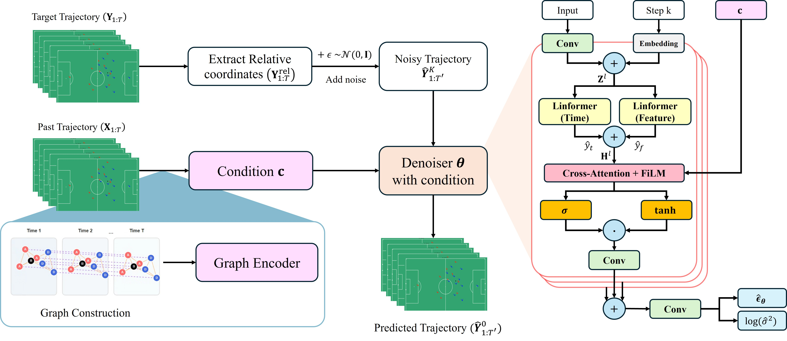
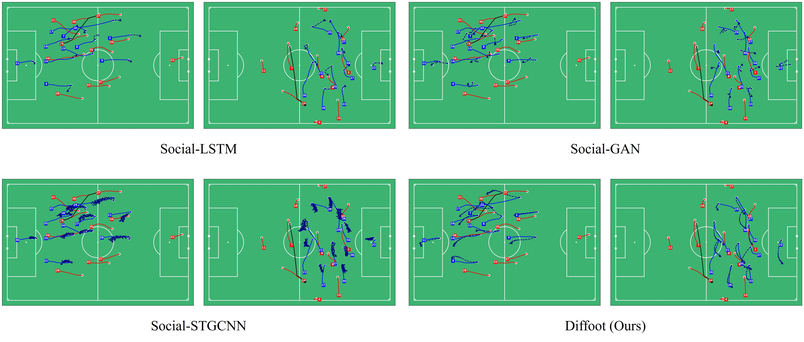

# Diffoot (Modifying)
Soure corde of  Diffoot - Graph-Conditioned Diffusion Model for Predicting Football Player Movements


(25.07.20) Submitted paper for BDE 2025 (2025 7th International Conference on Big Data Engineering)

# FrameWork


# Results


# Requirements
Use requirements.txt
```
pip install requirements.txt
```
Here's the main packages' versions below:
```
python=3.10
torch==2.4.0+cu121
floodlight==0.5.0
pandas == 2.2.3
numpy == 2.2.4
matplotlib == 3.10.1
```

# Get the data
Download the raw data [here](https://springernature.figshare.com/articles/dataset/An_integrated_dataset_of_spatiotemporal_and_event_data_in_elite_soccer/28196177)


# Reference github
[idsse-data](https://github.com/spoho-datascience/idsse-data?tab=readme-ov-file)

[LauireOnTracking](https://github.com/Friends-of-Tracking-Data-FoTD/LaurieOnTracking)

[Metrica Sports](https://github.com/metrica-sports/sample-data)

```    
    SoccerTrajPredict/
                ├── utils/                          # Util codes
                │      ├── data_utils.py            # utils for data processing
                |      ├── graph_utils.py           # utils for building graph data
                │      ├── data_processing.py       # processing tools from idsse-data
                │      ├── Metrica_EPV.py           # Tools from LauireOnTracking
                │      ├── Metrica_IO.py            
                │      ├── Metrica_PitchControl.py            
                │      ├── Metrica_Velocities.py            
                │      ├── Metrica_Viz.py       
                │      └── utils.py                 # essential tools from references
                ├── models/                         # Model codes
                │      ├── Diffoot.py               # Main diffusion model of Diffoot
                |      ├── Diffoot_modules.py       # Denoising network of Diffoot
                |      └── encoder.py               # Encoder model codes
                │
                ├── make_dataset.py             # Generating Dataset
                └── main_for_Diffoot.py         # Main.py for diffusion model
                │
                ├── requirements.txt            # Dependencies
                |
                └── README.md                   # Project documentation
```
